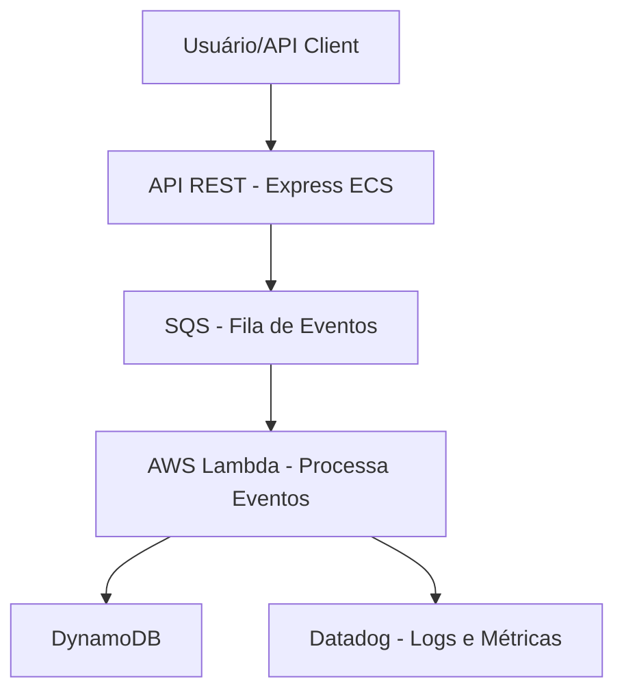

# 🚗 FleetOps – Plataforma Serverless de Eventos da Frota

**FleetOps** é um projeto inspirado em cenários reais de empresas como a Localiza, voltado para o processamento de eventos relacionados à gestão de frota (check-in, manutenção, incidentes, etc). Ele utiliza uma arquitetura moderna baseada em AWS Lambda, SQS, ECS (Fargate) e outras tecnologias cloud-native, com foco em escalabilidade, observabilidade e boas práticas de DevOps/SysOps.

## 🎯 Objetivo

Criar uma aplicação robusta que recebe eventos de frota via API REST, envia para uma fila (SQS), processa esses eventos via AWS Lambda e os persiste em uma base de dados. Tudo provisionado com infraestrutura como código (IaC) e monitorado via Datadog.

---

## 🧱 Arquitetura



## 🔧 Tecnologias Utilizadas

- Node.js + Express – API REST de entrada
- Docker + ECS (Fargate) – Containerização do backend
- AWS SQS – Fila de mensagens entre serviços
- AWS Lambda – Consumo e processamento assíncrono dos eventos
- Terraform – Provisionamento da infraestrutura

## ⚙️ Funcionalidades

- [X] Receber eventos via API (/events)
- [X] Validar e publicar os eventos na SQS
- [X] Processar eventos com Lambda
- [X] Persistir dados em banco DynamoDB
- [X] Expor métricas e logs no Datadog
- [X] Provisionar tudo com CloudFormation

## 🚀 Como rodar localmente

```bash
# 1. Clonar o projeto
git clone https://github.com/seu-usuario/fleetops.git
cd fleetops/backend

# 2. Instalar dependências
npm install

# 3. Rodar localmente (Docker)
docker build -t fleetops-api .
docker run -p 3000:3000 fleetops-api

# 4. Testar a API
curl -X POST http://localhost:3000/events \
  -H "Content-Type: application/json" \
  -d '{
    "vehicleId": "XYZ1234",
    "type": "check-in",
    "timestamp": "2025-04-18T12:00:00Z",
    "details": {
      "location": "Belo Horizonte",
      "fuelLevel": 80
    }
  }'
```


## 🚀 Infraestrutura da API Express com Terraform e AWS

Esse projeto provisiona a infraestrutura necessária para rodar uma API Node.js (Express) no **ECS Fargate** com imagem Docker hospedada no **ECR**, rede em **VPC pública**, e segurança configurada via **Security Group**.


### ✅ Pré-requisitos

Antes de começar, certifique-se de ter o seguinte instalado/configurado:

- [AWS CLI](https://docs.aws.amazon.com/cli/latest/userguide/install-cliv2.html)
- [Docker](https://www.docker.com/products/docker-desktop/)
- [Terraform](https://developer.hashicorp.com/terraform/install)
- Credenciais da AWS configuradas via:

```bash
aws configure
```

## 📦 1. Build e envio da imagem Docker para o ECR

A API precisa estar disponível em uma imagem Docker no Amazon ECR.

Passos:

```bash
# Build da imagem local
docker build -t express-backend .

# Tag da imagem (substitua <ACCOUNT_ID> pelo seu ID da AWS)
docker tag express-backend:latest <ACCOUNT_ID>.dkr.ecr.us-east-1.amazonaws.com/express-backend:latest

# Login no ECR
aws ecr get-login-password --region us-east-1 \
  | docker login --username AWS --password-stdin <ACCOUNT_ID>.dkr.ecr.us-east-1.amazonaws.com

# Push da imagem para o repositório do ECR
docker push <ACCOUNT_ID>.dkr.ecr.us-east-1.amazonaws.com/express-backend:latest
```

## 📁 2. Executando o Terraform

Com a imagem no ECR, vamos aplicar a infraestrutura com Terraform.

Passos:

```bash
# Acesse o diretório de infraestrutura
cd infra/terraform

# Inicialize o Terraform
terraform init

# Importar o repositório ECR já existente (evita recriação)
terraform import aws_ecr_repository.backend express-backend

# Aplique a infraestrutura
terraform apply
```

## 🌐 Acessando a API via Load Balancer (ALB)

Após a execução do terraform apply, sua aplicação estará disponível publicamente através do Load Balancer criado.

### 🔎 Como descobrir o DNS do Load Balancer

- Acesse o AWS Console.
- Vá até o serviço EC2.
- No menu lateral, clique em Load Balancers.
- Encontre o Load Balancer com o nome express-alb (ou o nome definido no seu alb.tf).
- Copie o valor do DNS Name (algo como express-alb-123456789.us-east-1.elb.amazonaws.com).

🚀 Testando a API
Com o DNS copiado, você pode testar sua API no navegador ou no terminal:

```bash
curl -X POST <DNS_ALB>/events \
  -H "Content-Type: application/json" \
  -d '{
    "vehicleId": "XYZ1234",
    "type": "check-in",
    "timestamp": "2025-04-18T12:00:00Z",
    "details": {
      "location": "Belo Horizonte",
      "fuelLevel": 80
    }
  }'
```

## 📁 Estrutura do Projeto

```bash
fleetops/
├── backend/              # API REST Express
├── lambda/              # Funções AWS Lambda
├── infra/                # CloudFormation templates
└── README.md
```

## 🧠 Motivação

Este projeto foi idealizado como forma de aprendizado e demonstração prática de habilidades relacionadas à área de SysOps/Cloud, com foco em automação, escalabilidade e boas práticas modernas de engenharia de software.

## 📜 Licença

Este projeto está licenciado sob a [MIT License](https://mit-license.org).
