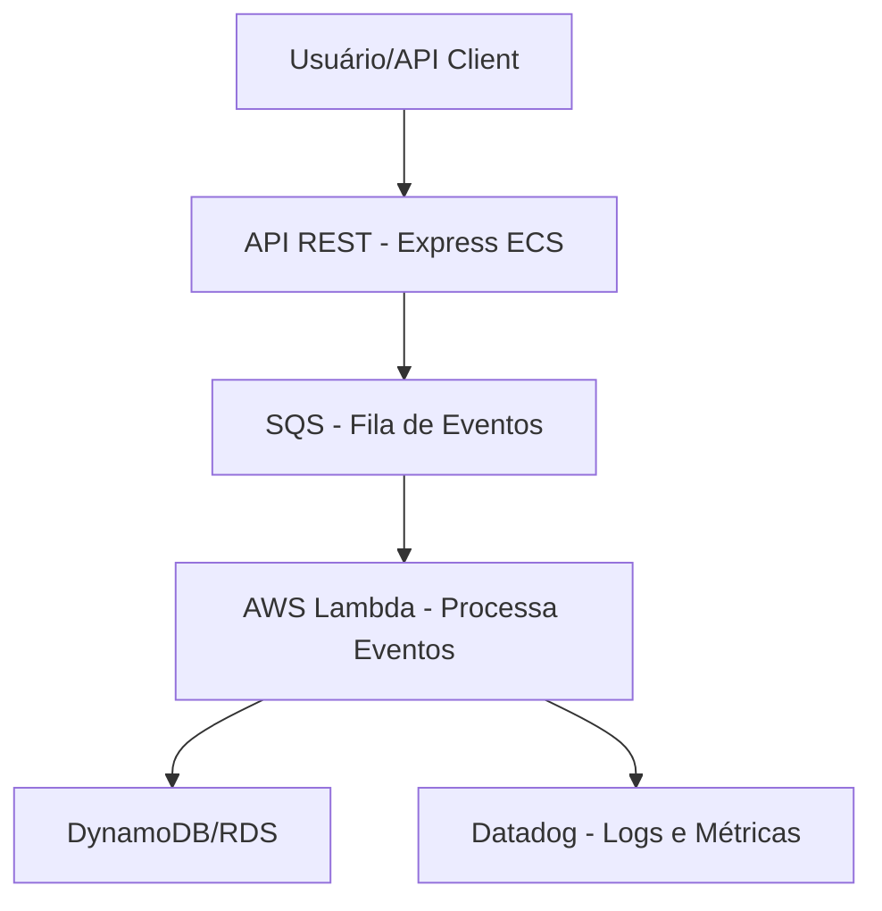

# 🚗 FleetOps – Plataforma Serverless de Eventos da Frota

**FleetOps** é um projeto inspirado em cenários reais de empresas como a Localiza, voltado para o processamento de eventos relacionados à gestão de frota (check-in, manutenção, incidentes, etc). Ele utiliza uma arquitetura moderna baseada em AWS Lambda, SQS, ECS (Fargate) e outras tecnologias cloud-native, com foco em escalabilidade, observabilidade e boas práticas de DevOps/SysOps.

## 🎯 Objetivo

Criar uma aplicação robusta que recebe eventos de frota via API REST, envia para uma fila (SQS), processa esses eventos via AWS Lambda e os persiste em uma base de dados. Tudo provisionado com infraestrutura como código (IaC) e monitorado via Datadog.

---

## 🧱 Arquitetura



## 🔧 Tecnologias Utilizadas

- Node.js + Express – API REST de entrada
- Docker + ECS (Fargate) – Containerização do backend
- AWS SQS – Fila de mensagens entre serviços
- AWS Lambda – Consumo e processamento assíncrono dos eventos
- CloudFormation – Provisionamento da infraestrutura
- GitHub Actions – CI/CD
- Datadog – Observabilidade (logs, métricas, rastreamento)
- Shell Script – Automação de testes e envio de eventos

## ⚙️ Funcionalidades

- [X] Receber eventos via API (/events)
- [X] Validar e publicar os eventos na SQS
- [X] Processar eventos com Lambda
- [X] Persistir dados em banco DynamoDB
- [X] Expor métricas e logs no Datadog
- [X] Provisionar tudo com CloudFormation

## 🚀 Como rodar localmente

```bash
# 1. Clonar o projeto
git clone https://github.com/seu-usuario/fleetops.git
cd fleetops/backend

# 2. Instalar dependências
npm install

# 3. Rodar localmente (Docker)
docker build -t fleetops-api .
docker run -p 3000:3000 fleetops-api

# 4. Testar a API
curl -X POST http://localhost:3000/events \
  -H "Content-Type: application/json" \
  -d '{
    "vehicleId": "XYZ1234",
    "type": "check-in",
    "timestamp": "2025-04-18T12:00:00Z",
    "details": {
      "location": "Belo Horizonte",
      "fuelLevel": 80
    }
  }'
```

## 📁 Estrutura do Projeto

```bash
fleetops/
├── backend/              # API REST Express
├── lambdas/              # Funções AWS Lambda
├── infra/                # CloudFormation templates
├── scripts/              # Scripts Shell de automação
├── .github/workflows/    # CI/CD com GitHub Actions
└── README.md
```

## 🧠 Motivação

Este projeto foi idealizado como forma de aprendizado e demonstração prática de habilidades relacionadas à área de SysOps/Cloud, com foco em automação, escalabilidade e boas práticas modernas de engenharia de software.

## 📜 Licença

Este projeto está licenciado sob a [MIT License](https://mit-license.org).
